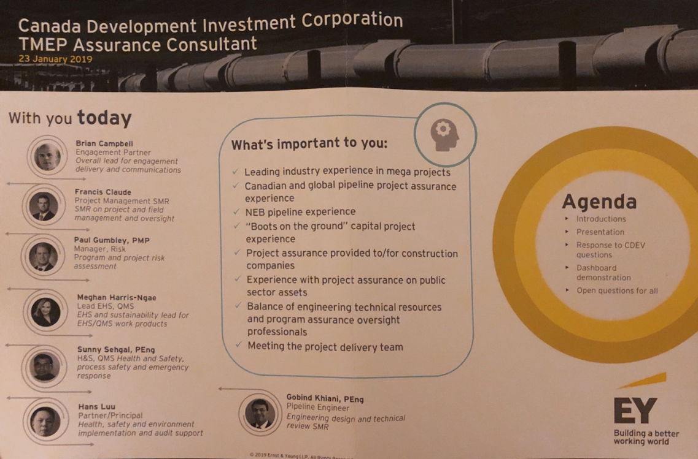
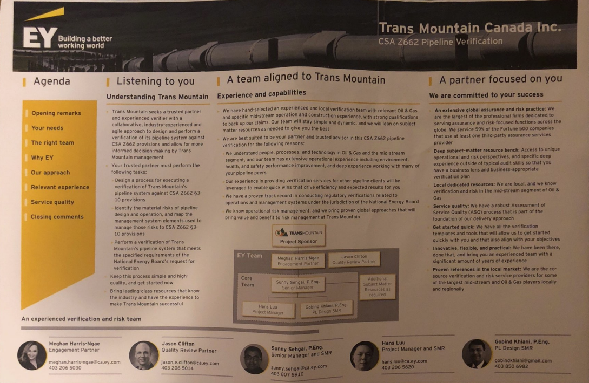

## Experience

- Asset Integrity, Operations Engineering & Valve Consultant for Enbridge Inc., over 9+ years

- Wood Group consulting for ICP project for Syncrude/Suncor, Fort Hills Suncor JV Tailings Development & KinderMorgan Standards Updates

- Sentio Engineering consulting for TideWater Midstream Relief Systems, Emmissions & Risk Assesements 

- Tytec LP consulting for Pembina Piglauncher stations, Burried Valve Program for CBU and OBU & Bellows Engineering Assesements 

- Ernst & Young consulting for Engineering Assessment Z662-15, Canada Development Investment Corporation (TMEP)

- Saguaro Resources consulting for Critical Service Valves & Plant Reliability Reviews 

- Consulting for NWR Partnership, Husky Refinery, Suncor Energy & CNRL on Severe/Critical Service Valves and associated piping (selection, sizing, and materials)

 

# Other Projects

- API Development Tools
- Activated Carbon Filtration Space
- Alkaline Surfactant Polymers Flooding for heavy oil enhancement
- Asset Integrity of Commercial Spaces
- Asset Integrity of buildings & warehouses
- Calcium chloride application in oil & gas
- Canadian Crude Exports | Rail/Pipelines 
- Carbon filtration/ players such as Jacobi, Chemviron, Desotec, Cabot etc. in Belgium, Germany and France, O&G sustainability OR asset operations
- Chemical Plant Operations
- Commercial architectural coating market in North America
- Condition monitoring market, Electric/hydraulic and pneumatic actuation in plants (oil and gas)
- Construction contractor benchmarking
- Construction equipment
- Crane Industries
- Cryogenic Valve Seats
- Current and Future Electrification Trends for Construction and Mining
- Customer Perspective, Gearbox Market for Valve Applications
- Digital Initiatives for Engineering Consulting
- Digital Solutions Users - Oil Field Services (well/field management)
- Drag reducing agents in pipelines
- EPC contractor in industrial automation space
- EPCs, Operating Model and Transformation
- EPma (Engineering and Procurement Management Assistance) in the Energy Sector
- Electric Actuation Trends, Regulation, landscape in north American oil and gas
- Emission monitoring and management
- Energy Management Solutions: Pharma/BioPharma
- Energy infrastructure – construction and maintenance
- Engineering and Construction (oil and gas sector)
- Engineering, Procurement & Construction (EPC) sustainability strategy
- Enterprise, resource planning – energy industry
- FEED or Pre-FEED Competition
- Field services automation software
- Filters used in Power Plants
- Flexible packaging in healthcare
- Flow Control products & procurement
- Front end loading in EPC companies
- Fugitive Emissions & Leak Management in O&G
- Gas Pipeline Geolocating | Procurement Perspective
- In-line (pipeline) inspection industry
- In-line pipeline inspection and pre-commissioning and maintenance solutions
- Industrial Pipes Valves & Fittings
- Industrial Plastic Piping | Purchasing, Perspective
- Industrial distribution market
- Industrial equipment manufacturing and services for Aggregates and Minerals/metals industries
- Industrial flowmeters and metering systems
- Industrial pumps and mixers
- Industrial/Commercial Refrigeration
- LDAR in US midstream O&G
- LNG in Mozambique Discussion
- Land Reclamation/ Restoration & Pipeline Services
- Large Capital Projects for Oil Companies
- Large Diameter Steel Pipes for oil and gas transportation and railway wheels sector
- Large diameter pipes for LNG, Engineering and, Construction Sector (EPC)
- Leak Detection and Repair Industry
- Metal seated ball valves
- Midstream Oil and Gas industry, Pipeline Construction/Maintenance Services (Industrial Distribution (petrochemical plants and refineries))
- Midstream and Downstream Chemical Facility Pipeline Repair
- Mission Critical Flow Control Devices
- NOx removal catalytic filters
- Natural Gas Maintenance
- Natural Gas Maintenance
- Natural Gas Subterranean Salt Dome Storage
- Non-Metallic Thermoplastic Materials | Technical O&G, Perspective
- North America terminal operations
- O&G Pipeline Remote Monitoring for Cathodic Protection
- O&G Pipeline Risk Assessment and Integrity Management
- OEMs & Engineering Service Provider
- Off-grid energy distributors market
- Oil & Gas I In-line inspection & related industries
- Oil & Gas Pipeline Segment
- Oil & Gas, Mining and Power services market
- Oil and gas production – onshore
- Oilfield waste management
- PVF: Industrial Pipes Valves & Fittings
- Petrochemical complexes & refineries
- Pipe Services / Pipecoating, US & Canada Steel Tubulars Market
- Pipe corrosion, detection and inspection,
- Pipeline Infrastructure Services
- Pipeline Inspection Services
- Pipeline Integrity Management
- Pipeline Monitoring | Landscape and Needs
- Pipeline Project Finance
- Pipelines and their sustainability
- Pipes & Adjacent Parts | End-User Customer Perspectives
- Pipes for Crude & Gas Gathering Systems | Customer/Distributor Perspective
- Plant construction and piping layout
- Power Plant Operations
- Process for selecting capital investment / program consultants
- Progressive cavity pumps for industrial mixer market
- Record management software
- Regulation landscape in north American pipeline industry
- Rising Stem Manual Valves
- Rubber components – Energy Industry
- Sensor systems for filling levels and managing pressures
- Smart Coatings
- Solenoid Pilot Valves, MMO (Maintenance, Modifications and Operations) & Engineering Services
- Steel Sourcing Strategies
- Steel pipe industry in North America
- Storage Tank Industry
- Sulphur Recovery Unit (SRU) Outsourcing Expert for Oil Refinery
- Technical Sealing Solutions | Industrial Processing Perspective
- Testing, inspection and certification (TIC) services industry - For Oil & Gas Company Users
- US infrastructure bill
- Underground Gas Storage Technologies
- Utilization of small power in pipelines
- Water conveyance and piping, oil and gas pipeline in-line inspection services
- Workforce Management Software

