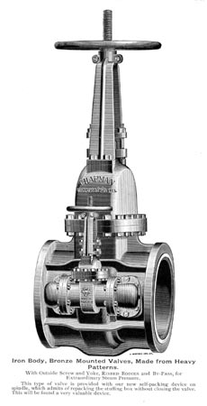

This rare image is from the 1882 Chapman Valve Company catalog. It shows an integrally cast mounting for a cast bypass assembly. In the days before fusion welding, this was the most popular way to provide bypasses on gate valves.

