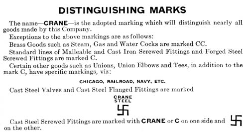

This is a portion of one of the material pages from the 1923 Crane catalog #23. It clearly describes the infamous Crane swastika logo that was applied to their cast steel products. The swastika unceremoniously disappeared from Crane valves in the 30’s as a certain country in Europe began using it.

