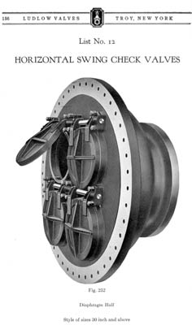

This odd check valve design was actually used by several manufacturers during the 20’s and 30’s. I guess maintenance was a problem because they were gone from manufacturer’s catalogs by WW II. This is from the Ludlow Valve Company 1925 catalog. Ludlow was based in Troy, New York. Both Ludlow and Rensselaer valves are still manufactured today under the Patterson Pump label.

