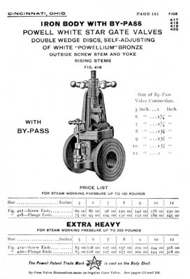

This page, from the Powell 1911 Catalog #10, shows a typical steam valve of that era. The lack of bolt holes was common in early valve catalogs, because there was not a common bolt hole standard back then. It was up to each customer to specify the required pattern information.

