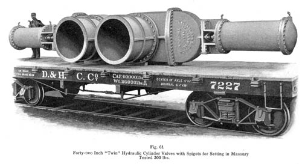

This image from the 1925 Rensselaer Valve Company 1925 catalog shows two 42” 300 WOG valves loaded on a flatcar for shipment. Rensselaer Valve was located in Troy, New York. They specialized in large diameter iron valves.

