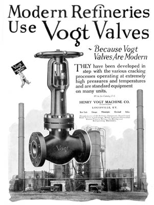

This ad was in a special pamphlet distributed by Vogt during the 30’s called, “Vogt Products for the Refinery.” Actually, the Vogt design was very modern, being forged instead of cast. During this period, Vogt manufactured forged steel valves in sizes up through NPS 6.

